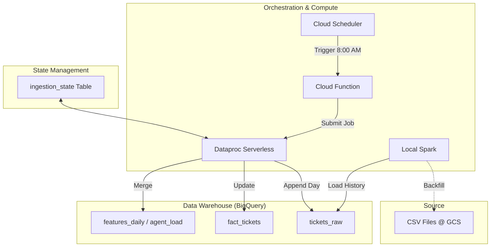

# 🎫 Operations Ticket Analytics Pipeline

A robust, end-to-end data engineering pipeline that processes operations support ticket data. It features a historical backfill system and a **fully automated daily simulation engine** using Dataproc Serverless to mimic real-world data ingestion.

---

## 📋 Table of Contents

- [Overview](#overview)
- [Architecture](#architecture)
- [Project Structure](#project-structure)
- [Data Flow](#data-flow)
- [Pipeline Components](#pipeline-components)
  - [1. Historical Backfill](#1-historical-backfill)
  - [2. Daily Automated Ingestion](#2-daily-automated-ingestion-new)
- [Key Features](#key-features)
- [Tech Stack](#tech-stack)
- [Monitoring](#monitoring)

---

## Overview

This project implements a complete data lifecycle for operations support tickets:
- **Historical Data**: Batch processing of Jan–Oct data (~95MB+).
- **Daily Simulation**: Automated daily ingestion of Nov–Dec data to simulate a live production environment.
- **Analytics**: Calculates Agent Performance, SLA Breaches, and Backlog metrics.

---

## Architecture

The architecture combines **Local Spark** for development/backfilling and **GCP Serverless** for automation.



---

## Project Structure

```
tickets-de-proj/
│
├── 📁 data/                          # Source data
├── 📁 scripts/                       # Local utility scripts
│   └── ingest_to_gcs.py             # Uploads partitioned CSVs to GCS
│
├── 📁 spark_jobs/                    # PySpark transformations
│   ├── gcs_to_bq_backfill.py        # Historical backfill job
│   └── transform_job.py             # Ad-hoc transformation logic
│
├── 📁 dataproc_serverless/           # 🚀 AUTOMATION MODULE
│   ├── daily_incremental_job.py     # The core daily PySpark job
│   ├── deploy.ps1                   # One-click deployment script
│   ├── trigger_function/            # Cloud Function code
│   └── README.md                    # Documentation for this module
│
└── README.md                         # This file
```

---

## Pipeline Components

### 1. Historical Backfill
**Scripts:** `gcs_to_bq_backfill.py` & `transform_job.py`
- **Purpose:** Loads the initial bulk of data (Jan–Oct) into BigQuery.
- **Method:** Runs locally using PySpark, reads from GCS, and writes to BigQuery.
- **Output:** Populates the baseline data for all analytics tables.

### 2. Daily Automated Ingestion (🆕)
**Script:** `dataproc_serverless/daily_incremental_job.py`
- **Purpose:** Simulates the daily arrival of new data (Nov–Dec).
- **Mechanism:**
  1. **Trigger:** Cloud Scheduler ticks at **8:00 AM IST** daily.
  2. **Execution:** Dataproc Serverless spins up a transient Spark cluster.
  3. **Intelligence:**
     - Checks `ingestion_state` table to find the next date to process.
     - **Duplicate Prevention:** Verifies if data for the target date exists before running.
     - **Optimization:** Processes *only* the new day's data in memory and appends to Fact tables, avoiding costly full-table overwrites.

---

## Key Features

- **🚀 Cost-Optimized Automation**: Uses **Dataproc Serverless** and **Cloud Functions** to stay almost entirely within the GCP Free Tier (Estimated <$1/month).
- **🧠 Intelligent State Management**: The pipeline "remembers" where it left off using a BigQuery state table. It automatically picks up the next day's data indefinitely.
- **⚡ Incremental Processing**: 
  - `fact_tickets`: Append-only (O(1) cost).
  - `features_daily`: Incremental updates.
  - No massive re-reads of historical data.
- **🛡️ Idempotency**: Built-in logic prevents processing the same date twice, ensuring data integrity.

---

## Output Tables

| Table Name | Type | Description |
|------------|------|-------------|
| `tickets_raw` | Raw | The landing zone for all daily CSV data. |
| `fact_tickets` | Fact | Cleaned, enriched ticket-level data (Append-only). |
| `features_daily` | Agg | Daily KPIs: TAT, Volume, SLA Breach %. |
| `daily_agent_load` | Agg | Agent performance metrics per day. |
| `backlog_daily` | Agg | Tracks the "snowballing" backlog of open tickets. |
| `daily_ops_metrics`| Agg | High-level operational summary. |

---

## Monitoring

- **Ingestion Progress**: 
  ```sql
  SELECT * FROM `ops_analytics.ingestion_state` ORDER BY simulation_date DESC
  ```
- **Job Logs**: Accessible via Dataproc Batches in Google Cloud Console.
- **Trigger Logs**: Viewable in Cloud Functions logging.

---

## Tech Stack

| Component | Technology |
|-----------|------------|
| **Orchestration** | Cloud Scheduler, Cloud Functions |
| **Compute** | Dataproc Serverless (PySpark 3.3) |
| **Storage** | Google Cloud Storage (GCS) |
| **Warehouse** | BigQuery |
| **Language** | Python 3.11 |

---

*Built by Aditya*
