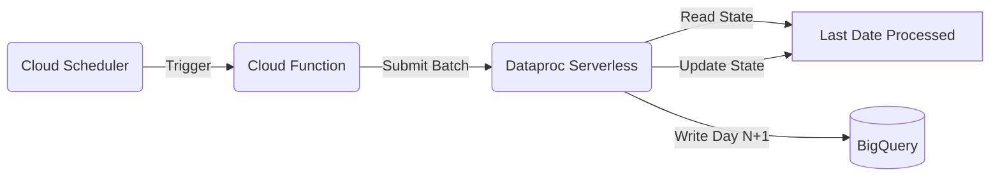

# 🤖 Automated Daily Incremental Ingestion (Dataproc Serverless)

This module automates the daily processing of ticket data for Nov–Dec, simulating a real-world production environment where new data arrives daily.

---

## ⚡ Overview

The core of this automation is a **stateful, self-healing pipeline** that:
1.  Wakes up every day at **8:00 AM IST**.
2.  Checks `ingestion_state` to see what was last processed.
3.  Ingests the *next available day* from GCS.
4.  Appends new rows to **fact tables** (O(1) cost).
5.  Updates aggregations (Features, Agent Load, SLA Risk).
6.  Prevents duplicates via built-in checks.

---

## 🏗️ Architecture



---

## 🚀 Deployment & Operations

### One-Click Deployment
To deploy or update the pipeline:

```powershell
./deploy.ps1
```
This script handles: API enablement, Service Account creation, Code upload to GCS, Function deployment, and Scheduler creation.

### Manual Operations

#### 1. Trigger an immediate run
If you missed a day or want to fast-forward:
```bash
gcloud scheduler jobs run daily-ticket-ingestion-scheduler --location=asia-south1
```

#### 2. Process specific date (Override)
To re-process a specific date:
```bash
# Get Function URL
echo "URL: $(gcloud functions describe trigger-daily-ingestion --region=asia-south1 --format='value(serviceConfig.uri)')"

# Trigger via curl
curl -X POST <URL> -H "Content-Type: application/json" -d '{"date": "2023-11-01"}'
```

#### 3. Reset a date (Wipe & Retry)
If data is corrupted for `2023-11-01`, run this script to clean up all related tables:
```bash
python fix_duplicate_date.py
```
*(Defaults to Nov 1. Edit the script to target other dates.)*

---

## 🔍 Monitoring

### Check Progress
Run this query in BigQuery to see the daily ingestion log:
```sql
SELECT 
    simulation_date, 
    ingestion_timestamp, 
    rows_ingested 
FROM `ops_analytics.ingestion_state`
ORDER BY simulation_date DESC
```

### Logs & Debugging
- **Function Logs:** `gcloud functions logs read trigger-daily-ingestion`
- **Batch Job Logs:** Go to **Dataproc > Serverless > Batches** in Cloud Console.

---

## 🛡️ Key Features

### 1. Incremental Optimization
Instead of overwriting the entire table daily, the job:
- **Filters** only the new day's data in memory.
- **Appends** directly to `fact_tickets` and derived tables.
- **Zero-History Reads:** No need to read `tickets_raw` again.

### 2. Duplicate Prevention
Before processing, the job runs a check:
```python
if check_if_date_exists(spark, "2023-11-02"):
    print("🛑 Skipping ingestion for 2023-11-02 to prevent duplicates.")
    return
```
This makes the pipeline idempotent—safe to retry multiple times.

### 3. State Tracking
The pipeline maintains its own cursor in `ingestion_state`. It automatically picks up where it left off, handling weekends or downtime gracefully.

---

## 📂 Configuration

| Parameter | Value | Location |
|-----------|-------|----------|
| **Schedule** | `0 8 * * *` (8 AM IST) | `deploy.ps1` |
| **Region** | `asia-south1` (Mumbai) | `deploy.ps1` / `main.py` |
| **Start Date** | `2023-11-01` | `daily_incremental_job.py` |
| **Max Executors** | 10 (Auto-scaling) | `main.py` |

---

*Documentation updated for production build.*
